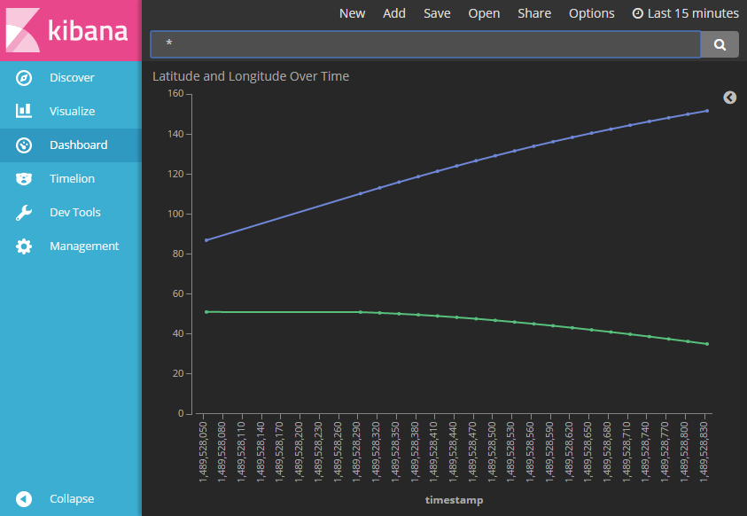

# CS499: Cloud Computing and Big Data
Assignment 4 - Data Monitor Dashboard using ElasticSearch and Kibana  

An application using ElasticSearch and Kibana to build a data analysis dashboard.

--------

1. The following url (http://open-notify.org/Open-Notify-API/ISS-Location-Now/) describes how a simple API was implemented to 
retrieve the current latitude and longitude of the [International Space Station](https://en.wikipedia.org/wiki/International_Space_Station).  
The API endpoint resides at (http://api.open-notify.org/iss-now.json).

2. In this simple application written using NodeJS, I call this API at a set interval of 30 seconds. The data obtained is
subsequently stored as a new document in my ElasticSearch server, with the following index: iss.

3. My Kibana service loads the data from my ElasticSearch service into its <b>[dashboard](https://search-iss-location-retriever-szmxnpkkzrg3mpgozu6exz4i2e.us-east-1.es.amazonaws.com/_plugin/kibana/app/kibana#/dashboard/ISS-Location?_g=())</b>.

Screenshots 
--------

